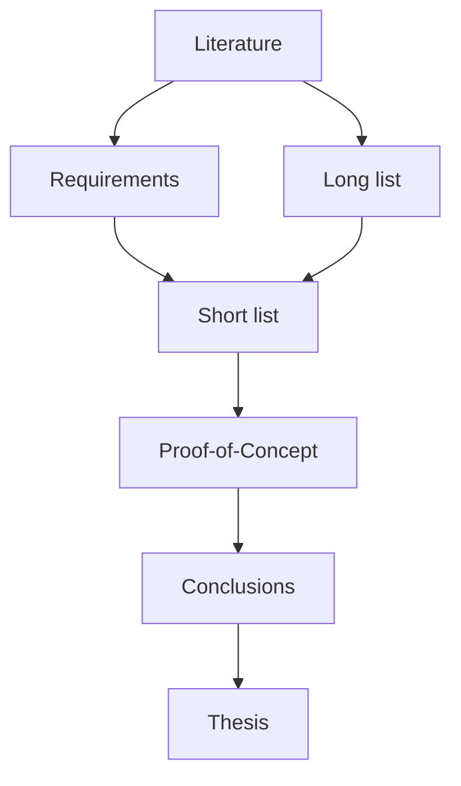
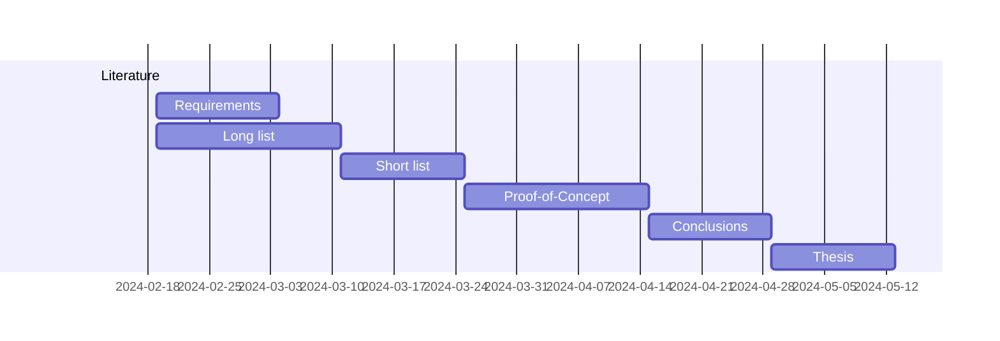

# Phase 5. Methodology.

- Write a plan of action for the course of your bachelor thesis in the Methodology section of the paper.

- Divide the process into different phases and describe specificallly what you will do in each phase, why and what the result should be (deliverables). Avoid vague descriptions such as "investigate", "conduct research", but try to be as specific as possible!

    - In a literature review, for example, what exactly are you going to look up? General info about the subject (give some keywords or specific topics you are going to search for), compile a list of all possible tools/frameworks/... that you can use to build a solution for the problem (long list), search what the current approach is to these kinds of problems, what research has already been done within this domain, ...

    - If you are going to carry out a comparative study, also write out the different phases in full: case description (current state, AS IS), requirement analysis (TO BE), long list, short list, etc.

    - If you are going to carry out an experiment, describe the set-up and exactly what data you are going to collect.

    - Also describe the end result or deliverable of each phase. What tangible result does each phase have? This can be, for example, a summary of the specialist literature, a list of requirements structured according to the MoSCoW method, a test setup consisting of virtual machines, etc.

    - Avoid the "waterfall model", but use an iterative approach.

    - If you ask ChatGPT to write out your methodology, the result will be a word salad without any substance, too vague and consequently completely useless (and will also result in a grade of 0 for the paper). So write the text yourself!

- Try to think of a timing for each phase. Give yourself deadlines for each phase/deliverable!

    - Some deadlines are fixed, such as the submission of the paper. Work backwards from these deadlines to determine when you should have completed each phase. If we assume you enroll for the Bachelor's thesis in the model track:

        - End of fall semester, week 12: submit research proposal
        - End of spring semester, week 1: submit improved proposal (after feedback by promotor)
        - End of week 6: draft version literature review
        - End of week 11: draft version thesis
        - End of week 13: final version thesis

    - When you describe how long a phase will take, be specific. Keep in mind that in the typical model track, you're supposed to spend 4 days a week on your internship and 1 day on your thesis research.

        - If you write that you're going to work for *one week* on a specific phase, what do you mean exactly? 1 working day or 5 working days spread over five weeks? Or maybe you're going to work on it in the weekend as well?

        - Allow sufficient time for the most important phases of the research, such as implementing a Proof of Concept (PoC) and conducting experiments.

        - A normal time course for the Bachelor's thesis is to start at the beginning of semester 2 and submit it on Friday of the first exam week.
    - When you write e.g. that you're going to work for *one week* on a specific phase, what do you mean exactly? 

- Visualize the action plan with a flow chart or Gantt chart.

     You can edit flowcharts, Gantt or other charts in Mardown at [Mermaid](https://mermaid.js.org). In VS Code you can install the [Markdown Preview Mermaid Support](https://marketplace.visualstudio.com/items?itemName=bierner.markdown-mermaid) for this.

     If you want to use the image in your proposal, you can search for a tool to convert the code into images, or you can take a screenshot in the Preview and save it. The VS Code plugin [Markdown PDF Export](https://marketplace.visualstudio.com/items?itemName=yzane.markdown-pdf) also correctly converts Mermaid charts. **Take screenshots in light mode!** Dark mode screenshots are harder to read and they don't look good in the document.

## Examples

With a flowchart you can visualize the dependencies between phases

A Gantt chart also shows how you plan the different phases in time. Here you also see that some phases can overlap (such as the literature study here) or run parallel.

